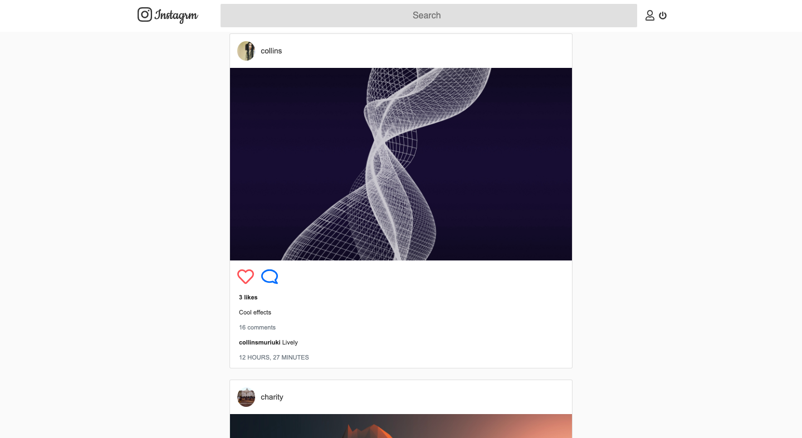
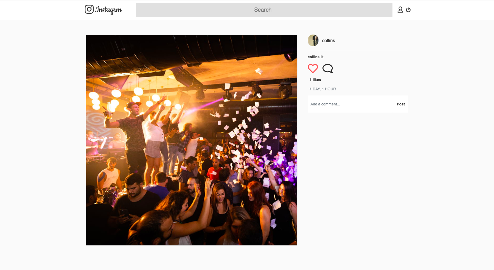
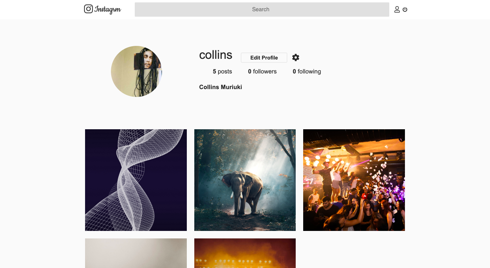

# Instagrm

#### A Django Instagram clone

## User Story
User can sign in to the application to start using.
User can upload my pictures to the application.
User can view any profile with all pictures.
User can like a picture and leave a comment on it.

## Behavior Driven Development

| Input                    | Behaviour                       | Output                                       |
| -------------------------| ------------------------------  | -------------------------------------------- |
| User registers for an account by filling form            | Page redirects user to login page               | User is redirected tpo login page               |
| User logs in             | User is taken to the home page | Redirect you to the homepage where the user is greeted with a feed of most recent photos posted             |
| User clicks upload button and fills the form         | The page reloads    | User's new post is displayed on the feed                     | 
| User clicks on the like button | The page reloads | Like count of the post is increased by one value   |
| User clicks on the comment button| User is redirected to a page containing the single post, its comments and a comment form    | A page displaring the single post is displayed                 |
| User posts a comment by filling the form       | The page reloads    | The new comment is added onto the post's comment section , showing th comment and its author, and comment count is updated  in the feed            |

## Author
[Collins Muriuki](https://github.com/collinsmuriuki), 17/11/2019.

## Technologies Used
* Python 3.7.4
* Django 1.11.23
* SQLite3
* HTML5  
* CSS3
* Javascript
* jQuery 3.4.1
* Bootstrap 4.3.1
* Font-Awesome
* Google Font API

## Requirements
* This program requires python3.+ (and pip) installed, a guide on how to install python on various platforms can be found [here](https://www.python.org/)
* Once python is installed, install the folowing external libraries provided in the requirements.txt file using pip
* Example: 
    * **`pip install django==1.11.23`**
* This project requires you to have a secret key from Uploadcare to facilitate cloud storage of uploaded images.
    * The secret key can be gotten by creating a free uploadcare account, starting a new project and navigating to the dashboard
    * The key should be stored as an enviremnetal variable in an .env file as hown below
        * **`SECRET=<your secret key here>`**
    * More info onhow to use the Django pyuploadcare library can be found [here](https://uploadcare.com/docs/guides/django/)

## Installation and Set-up
To view the app, open the live site link provided below on the README.
Here is a run through of how to set up the application:
* **Step 1** : Clone this repository using **`git clone https://github.com/collinsmuriuki/instagrm.git`**, or downloading a ZIP file of the code.
* **Step 2** : The repository, if downloaded as a .zip file will need to be extracted to your preferred location and opened
* **Step 3** : Go to the project root directory and install the virtualenv library using pip an afterwards create a virtual environment. Run the following commands respectively:
    * **`pip install virtualenv`**
    * **`virtualenv venv`**
    * **`source venv/bin/activate`**
        * Note that you can exit the virtual environment by running the command **`deactivate`**
* **Step 4** : Download the all dependencies in the requirements.txt using **`pip install -r requirements.txt`**
* **Step 5** : You can now launch the application locally by running the command **`python manage.py runserver`** and copying the link given on the termnal on your browser.
    * To post photos, run the command  **`python manage.py createsuperuser`** to create an admin account in order to post. Access to the admin panel is by adding the path /admin to the address bar.

## Known Bugs
* Search functionality is buggy, fix coming soon
* User authentication bug when a user enters the wrong login credentials.

## Support and contact details
You can provide feedback or raise any issues/ bugs through the following means:
* murerwacollins@gmail.com

## Live Site link
You can view the live application by following this [link](https://instagramcl0n3.herokuapp.com/).

## License
#### [*GNU License*](LICENSE)